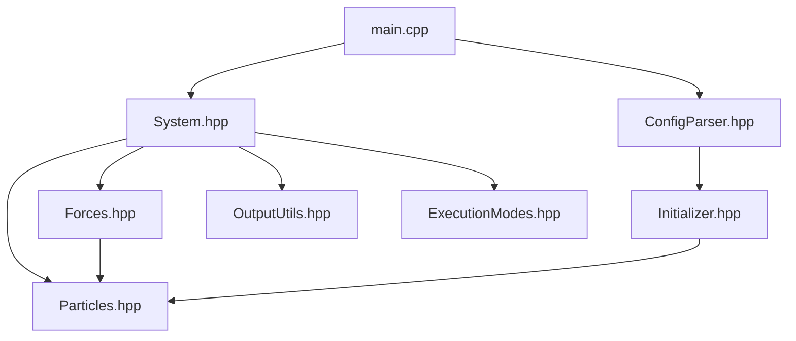

## Core Module Overview

The `simulator/core` directory contains the main logic for the N-body simulation, including configuration parsing, system initialization, force calculation, integration methods, and simulation control. This module is designed to be modular and extensible, supporting both CPU and GPU execution.

### Main Components

- **[`main.cpp`](main.cpp)**  
  Entry point of the simulation. Loads configuration, initializes the particle system, sets up simulation parameters, and dispatches execution to the appropriate mode (benchmark, CSV output, or visualization).

- **[`ConfigParser.hpp`](ConfigParser.hpp)**  
  Parses the JSON configuration file and creates the appropriate initializer and simulation parameters. Centralizes all configuration logic.

- **[`Initializer.hpp`](Initializer.hpp) & [`Initializer.cpp`](Initializer.cpp)**  
  Provides multiple initialization routines for the particle system (random, galaxy, spiral galaxy, stellar system, or from file). Returns both the initialized particles and metadata.

- **[`System.hpp`](System.hpp) & [`System.cpp`](System.cpp)**  
  Implements the main simulation loop, integration methods (Euler, Velocity Verlet), force calculation dispatch, output, benchmarking, and visualization. Acts as the orchestrator for the simulation.

- **[`Forces.hpp`](Forces.hpp) & [`Forces.cpp`](Forces.cpp)**  
  Implements force and acceleration calculations, including pairwise, adaptive mutual softening, and Barnes-Hut methods. Includes auto-tuning and profiling utilities.

- **[`Particles.hpp`](Particles.hpp)**  
  Defines the particle data structure, optimized for both CPU and CUDA execution. Handles memory management and provides efficient accessors.

- **[`ExecutionModes.hpp`](ExecutionModes.hpp)**  
  Defines the available execution modes (CPU, GPU).

### File Relationships

- **`main.cpp`**  
  - Uses `parseConfig()` from [`ConfigParser.hpp`](ConfigParser.hpp) to load configuration.
  - Calls `createInitializerFromConfig()` to initialize particles via [`Initializer.cpp`](Initializer.cpp).
  - Instantiates [`System`](System.hpp) and calls its methods for simulation control.

- **`System.cpp`**  
  - Depends on [`Particles.hpp`](Particles.hpp) for particle data.
  - Uses force calculation functions from [`Forces.hpp`](Forces.hpp).
  - Calls output utilities and visualization kernels.
  - Dispatches integration steps based on configuration.

- **`Initializer.cpp`**  
  - Implements various initialization routines, used by `main.cpp` via `ConfigParser.hpp`.

- **`Forces.cpp`**  
  - Implements force calculation algorithms, used by [`System.cpp`](System.cpp).
  - Uses particle data from [`Particles.hpp`](Particles.hpp).

- **`Particles.hpp`**  
  - Used throughout the core for particle storage and manipulation.

### Suggested Dependency Graph

You may visualize the relationships as follows:

```
main.cpp
   ├── ConfigParser.hpp
   │      └── Initializer.hpp / Initializer.cpp
   └── System.hpp / System.cpp
           ├── Particles.hpp
           ├── Forces.hpp / Forces.cpp
           ├── OutputUtils.hpp
           └── ExecutionModes.hpp
```

Or as a diagram (for documentation or developer onboarding):



### Notes

- The modular design allows easy extension of initialization routines, force calculation methods, and integration schemes.
- All configuration is centralized in [`ConfigParser.hpp`](ConfigParser.hpp), making it easy to add new parameters or initialization types.
- The code supports both CPU and GPU execution, with memory management optimized for CUDA when