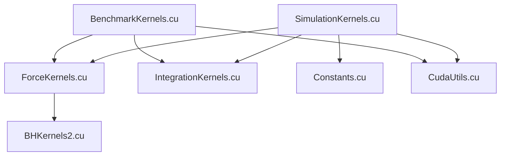

## CUDA Stack Overview

The `simulator/cuda` directory contains all GPU-accelerated kernels and utilities for high-performance N-body simulation. This stack is designed for modularity, supporting multiple force calculation methods, integration schemes, benchmarking, and efficient memory management.

### Main Components

- **[`SimulationKernels.cu`](SimulationKernels.cu) / [`SimulationKernels.h`](SimulationKernels.h)**
  - Main entry point for running the full N-body simulation on the GPU.
  - Handles memory allocation, kernel launches, integration loop, and data transfer between host and device.
  - Supports both Euler and Velocity Verlet integration methods.
  - Coordinates force calculation via kernel dispatch.

- **[`ForceKernels.cu`](ForceKernels.cu) / [`ForceKernels.cuh`](ForceKernels.cuh)**
  - Implements CUDA kernels for pairwise, adaptive mutual, and Barnes-Hut force calculations.
  - Provides a kernel selector for runtime dispatch based on the chosen force method.
  - Includes memory tiling and shared memory optimizations for performance.

- **[`IntegrationKernels.cu`](IntegrationKernels.cu) / [`IntegrationKernels.cuh`](IntegrationKernels.cuh)**
  - Implements CUDA kernels for Euler and Velocity Verlet integration steps.
  - Includes kernels for energy calculation and particle state storage.
  - Provides a unified integration step function for use in simulation and benchmarking.

- **[`BHKernels2.cu`](BHKernels2.cu) / [`BHKernels2.cuh`](BHKernels2.cuh)**
  - Implements the Barnes-Hut tree construction and traversal for fast approximate force calculation.
  - Manages persistent device memory for tree nodes and bounding boxes.
  - Includes diagnostic and momentum correction kernels.

- **[`BenchmarkKernels.cu`](BenchmarkKernels.cu) / [`BenchmarkKernels.h`](BenchmarkKernels.h)**
  - Provides a minimal-overhead benchmark mode for performance testing.
  - Runs the simulation loop without energy calculation or data transfer, reporting steps/sec and particle-steps/sec.

- **[`CudaUtils.cu`](CudaUtils.cu) / [`CudaUtils.cuh`](CudaUtils.cuh)**
  - Utility functions for error checking, device property queries, block/grid size calculation, and occupancy heuristics.
  - Includes macros and helpers for robust CUDA development.

- **[`Constants.cu`](Constants.cu) / [`Constants.cuh`](Constants.cuh)**
  - Defines and initializes physical constants in device constant memory for fast access in kernels.

### File Relationships

- **`SimulationKernels.cu`**
  - Calls force kernels from [`ForceKernels.cu`](ForceKernels.cu) and integration kernels from [`IntegrationKernels.cu`](IntegrationKernels.cu).
  - Uses device constants from [`Constants.cu`](Constants.cu).
  - Allocates and manages device memory, streams, and events.

- **`ForceKernels.cu`**
  - Uses physical constants from [`Constants.cuh`](Constants.cuh).
  - Calls Barnes-Hut kernels from [`BHKernels2.cu`](BHKernels2.cu) when needed.

- **`IntegrationKernels.cu`**
  - Uses force kernel selector from [`ForceKernels.cuh`](ForceKernels.cuh).
  - Called by both simulation and benchmark kernels.

- **`BenchmarkKernels.cu`**
  - Runs the integration loop using kernels from [`IntegrationKernels.cu`](IntegrationKernels.cu) and [`ForceKernels.cu`](ForceKernels.cu).
  - Uses utilities from [`CudaUtils.cu`](CudaUtils.cu).

### Suggested Dependency Graph

```
SimulationKernels.cu
   ├── ForceKernels.cu
   │      └── BHKernels2.cu
   ├── IntegrationKernels.cu
   ├── Constants.cu
   └── CudaUtils.cu
BenchmarkKernels.cu
   ├── IntegrationKernels.cu
   ├── ForceKernels.cu
   └── CudaUtils.cu
```

Or as a diagram:



### Architecture Notes & Suggestions

- **Modularity:**  
  Each kernel type (force, integration, Barnes-Hut) is separated for maintainability and extensibility.
- **Performance:**  
  Uses shared memory, tiling, and occupancy heuristics for optimal GPU utilization. Block size selection is empirically tuned for N-body workloads.
- **Benchmarking:**  
  Dedicated benchmark mode allows for rapid performance evaluation without unnecessary data transfer overhead.
- **Extensibility:**  
  Adding new force or integration methods is straightforward thanks to kernel selectors and modular headers.
- **Error Handling:**  
  Robust error checking and resource cleanup are implemented throughout the stack.

---

This CUDA stack enables scalable, high-performance N-body simulation, supporting millions of particles and multiple physical models, with careful attention to GPU resource