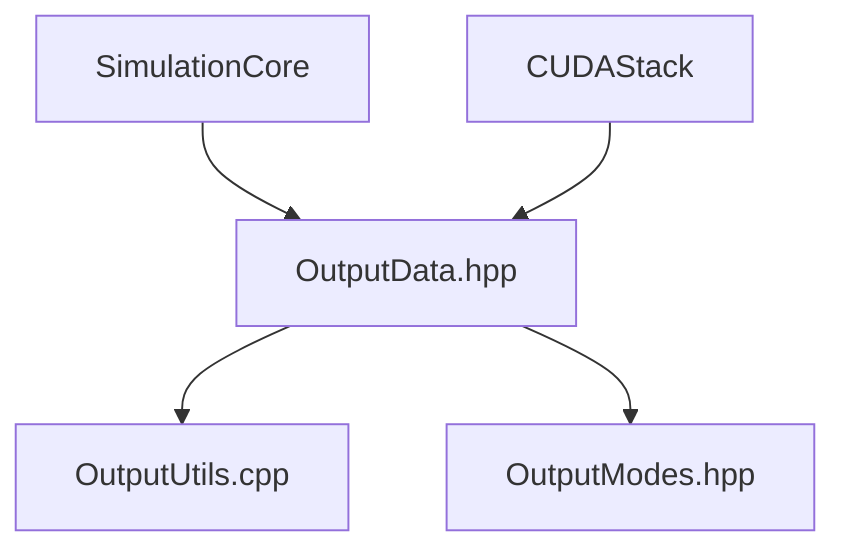

## Output Stack Overview

The `simulator/output` directory manages all aspects of simulation data output, including formatting, file writing, and progress reporting. It is designed to efficiently handle large datasets produced by N-body simulations, supporting both CPU and GPU execution modes.

### Main Components

- **[`OutputData.hpp`](OutputData.hpp)**
  - Defines the `OutputData` structure, which stores all simulation results in a GPU-friendly format.
  - Manages host and device memory for particle data, system data (time, energy), and static data (particle ID, mass).
  - Supports both pinned and regular memory allocation, with move semantics and execution mode switching.
  - Provides methods for setting and accessing data, as well as copying between device and host.

- **[`OutputUtils.hpp`](OutputUtils.hpp) / [`OutputUtils.cpp`](OutputUtils.cpp)**
  - Provides utility functions for writing simulation results to CSV files (`flushCSVOutput`).
  - Implements a progress bar (`printProgressBar`) for real-time feedback during simulation.
  - Handles metadata and header formatting for output files.

- **[`OutputModes.hpp`](OutputModes.hpp)**
  - Defines the available output modes: benchmark (no output), CSV file output, and real-time visualization.

### File Relationships

- **`OutputData.hpp`**
  - Used by the simulation core and CUDA stack to store and manage output data.
  - Provides device and host pointers for efficient data transfer and access.

- **`OutputUtils.cpp`**
  - Writes data from `OutputData` to disk in CSV format, including metadata and per-timestep energy.
  - Called by the simulation core when output mode is set to CSV.
  - Displays progress bar during long-running simulations.

- **`OutputModes.hpp`**
  - Used by the simulation core to select the desired output mode.

### Suggested Dependency Graph

```
Simulation Core / CUDA Stack
   └── OutputData.hpp
         ├── OutputUtils.cpp
         └── OutputModes.hpp
```

Or as a diagram:



### Architecture Notes & Suggestions

- **Efficiency:**  
  OutputData uses pinned memory for fast GPU-to-CPU transfers when running in GPU mode, and regular memory for CPU mode.
- **Scalability:**  
  Designed to handle millions of particles and thousands of timesteps without excessive memory overhead.
- **Extensibility:**  
  Adding new output formats or modes is straightforward thanks to the modular structure.
- **User Feedback:**  
  The progress bar provides real-time feedback, improving usability for long simulations.
- **Robustness:**  
  OutputData includes bounds checking and error reporting for safe data access.

---

This output stack ensures that simulation results are efficiently stored, transferred, and written to disk, supporting both high-performance GPU runs and flexible output options for analysis