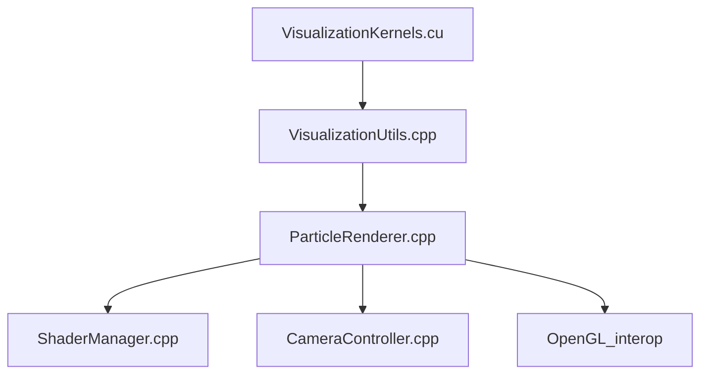

## Visualization Stack Overview

The `simulator/visualization` directory provides the GPU-accelerated rendering and interactive visualization for the N-body simulation. It is designed to be modular, separating concerns such as rendering, camera control, shader management, and CUDA/OpenGL interoperability.

### Main Components

- **[`ParticleRenderer.h`](ParticleRenderer.h) / [`ParticleRenderer.cpp`](ParticleRenderer.cpp)**
  - Central class for particle visualization.
  - Handles OpenGL buffer setup, rendering loop, particle updates, and CUDA-OpenGL interop.
  - Manages point size, color mode, coordinate axes, and camera delegation.

- **[`ShaderManager.h`](ShaderManager.h) / [`ShaderManager.cpp`](ShaderManager.cpp)**
  - Compiles and links OpenGL shaders for particles and axes.
  - Sets shader uniforms and creates particle textures.
  - Encapsulates shader source code and OpenGL program management.

- **[`CameraController.h`](CameraController.h) / [`CameraController.cpp`](CameraController.cpp)**
  - Manages camera transformations, view/projection matrices, and user input for rotation, panning, and zoom.
  - Provides methods for resetting and updating camera state.

- **[`VisualizationUtils.h`](VisualizationUtils.h) / [`VisualizationUtils.cpp`](VisualizationUtils.cpp)**
  - Utility namespace for window management, input callbacks, keyboard controls, and renderer initialization.
  - Handles OpenGL context setup, GLEW initialization, and global visualization state.

- **[`cuda/VisualizationKernels.h`](cuda/VisualizationKernels.h) / [`cuda/VisualizationKernels.cu`](cuda/VisualizationKernels.cu)**
  - CUDA kernels for updating OpenGL buffers directly from simulation data.
  - Main entry point for running visualization on GPU, including physics integration and rendering loop.
  - Supports both CUDA-OpenGL interop and CPU fallback.

### File Relationships

- **`VisualizationKernels.cu`**  
  - Calls `VisualizationUtils::initVisualization()` to set up the window and renderer.
  - Uses `ParticleRenderer` for buffer updates and rendering.
  - Interacts with CUDA device memory and OpenGL buffers for efficient visualization.

- **`VisualizationUtils.cpp`**  
  - Instantiates `ParticleRenderer` and manages its lifecycle.
  - Sets up input callbacks that delegate to `CameraController` and `ParticleRenderer`.
  - Provides keyboard shortcuts for interactive control.

- **`ParticleRenderer.cpp`**  
  - Uses `ShaderManager` for shader compilation and uniform setting.
  - Delegates camera operations to `CameraController`.
  - Registers and maps CUDA resources for direct GPU rendering.

- **`ShaderManager.cpp`**  
  - Provides GLSL source code for vertex and fragment shaders.
  - Handles OpenGL program creation and uniform updates.

- **`CameraController.cpp`**  
  - Computes view and projection matrices for 3D navigation.
  - Processes mouse and keyboard input for camera movement.

### Suggested Dependency Graph

```
VisualizationKernels.cu
   ├── VisualizationUtils.cpp
   │      └── ParticleRenderer.cpp
   │             ├── ShaderManager.cpp
   │             └── CameraController.cpp
   └── OpenGL_interop
```

Or as a diagram:



### Architecture Notes & Suggestions

- **Modularity:**  
  The current design separates rendering, camera, and shader logic, improving maintainability and extensibility.
- **CUDA/OpenGL Interop:**  
  Direct buffer mapping enables efficient GPU-to-GPU visualization, with CPU fallback for unsupported hardware.
- **User Interaction:**  
  Keyboard and mouse controls allow real-time navigation, zoom, color mode switching, and more.
- **Further Improvements:**  
  - Consider splitting shader source code into dedicated files for easier editing.
  - A future `ParticleStyleManager` could further modularize appearance logic (color, size, texture).
  - Documentation of keyboard controls and architecture helps onboarding and usage.

### Keyboard Controls

See [`VisualizationUtils.cpp`](VisualizationUtils.cpp) for a full list of interactive controls (WASD, arrows, +/- for zoom, C for color mode, etc).

---

This modular visualization stack enables high-performance, interactive exploration of large-scale N-body simulations, leveraging both CUDA and OpenGL for optimal results.
